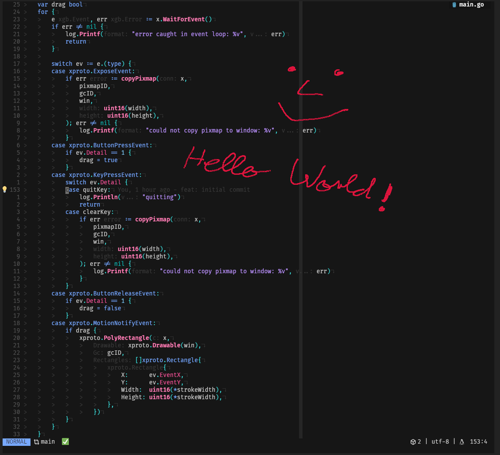

# godraw



<!--toc:start-->
- [godraw](#godraw)
  - [Usage](#usage)
    - [Quit](#quit)
    - [Clear](#clear)
    - [Flags](#flags)
  - [Installation](#installation)
  - [Build](#build)
  - [Why](#why)
<!--toc:end-->

A simple tool that allows you to draw on the current screen

## Usage

Simply execute the binary and a drawable screenshot of your screen will open
```bash 
godraw
```

### Quit
You can exit the program with `q`

### Clear
To clear the screen press `c`

### Flags
```
Usage of godraw:
  -color uint
        the color of the pencil (hex) (default 14423100)
  -stroke-width int
        the stroke width of the pencil (default 2)
```
Example:

```bash
godraw --color 0xff
```

## Installation

```bash
go install github.com/oscgu/godraw@latest
```

> [!IMPORTANT]
> Make sure `$HOME/go/bin` is part of your `$PATH`

## Build

```bash
go build -o godraw .
```

## Why

When screen sharing and explaining code, it's often helpful to highlight or 

underline specific sections to direct the listeners attention.
